# 🍽️ Restaurant IHEC Manager

## 📌 Description

**Restaurant IHEC Manager** est une application desktop développée en **C# Windows Forms** permettant la gestion complète du restaurant universitaire de l’IHEC Carthage.

Le projet a été réalisé dans le cadre du module de **Programmation Événementielle** afin d’automatiser :
- la gestion des utilisateurs
- la gestion des menus
- les réservations des repas
- les statistiques
- ainsi que le système d’avis étudiants.

---

# ✨ Fonctionnalités Principales

## 👨‍🎓 Espace Étudiant
- Inscription avec vérification par e-mail
- Authentification sécurisée
- Consultation du menu hebdomadaire
- Réservation des repas
- Annulation des réservations
- Historique des réservations
- Système d’avis et évaluations

---

## 👨‍🍳 Espace Chef
- Gestion des menus hebdomadaires
- Ajout / Modification / Suppression des plats
- Gestion des quantités disponibles
- Consultation des statistiques

---

## 👨‍💼 Espace Administrateur
- Gestion des étudiants et du personnel
- Tableau de bord statistique
- Gestion des avis étudiants

---

# 🔐 Fonctionnalités Avancées

## Authentification Double Facteur
Système de vérification par e-mail avec génération de codes de validation via SMTP Gmail.

## Transactions SQL
Gestion sécurisée des réservations et annulations avec `SqlTransaction`.

## Dashboard Statistique
- Diagrammes en barres
- Diagrammes circulaires
- Statistiques en temps réel

## Système d’Avis Étudiants
Évaluation des repas selon plusieurs critères :
- qualité des plats
- temps d’attente
- propreté
- accueil
- rapport qualité/prix

---

# 🛠️ Technologies Utilisées

| Technologie | Description |
|---|---|
| C# | Développement de l’application |
| Windows Forms | Interface graphique |
| SQL Server | Base de données |
| ADO.NET | Accès aux données |
| Visual Studio 2022 | IDE |

---

# 🗄️ Architecture du Projet

L’application suit une architecture multicouche :

- Couche Présentation (UI)
- Couche Métier
- Couche Accès Données
- Couche Base de Données

---

# 📊 Modules Principaux

| Module | Description |
|---|---|
| `P1_Admin.cs` | Dashboard administrateur |
| `P1_Chef.cs` | Dashboard chef |
| `P1_Etudiant.cs` | Dashboard étudiant |
| `Menu_jour.cs` | Gestion des menus |
| `Reservation.cs` | Réservation des repas |
| `Dashbord.cs` | Statistiques |
| `AvisEtudiant.cs` | Gestion des avis |
| `EmailService.cs` | Service d’e-mails |

---
## 🖼️ Aperçu des Pages

---

### 🏠 Page d'Accueil — Portail principal avec accès Étudiant, Admin et Chef
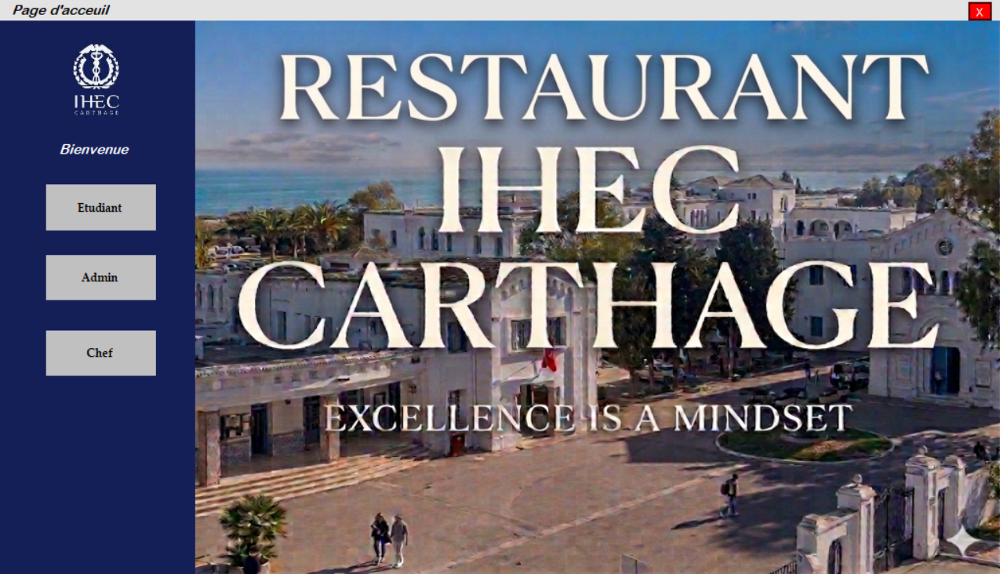

---

## 👨‍🎓 Espace Étudiant

### 🏡 Accueil Étudiant — Tableau de bord avec navigation vers toutes les fonctionnalités
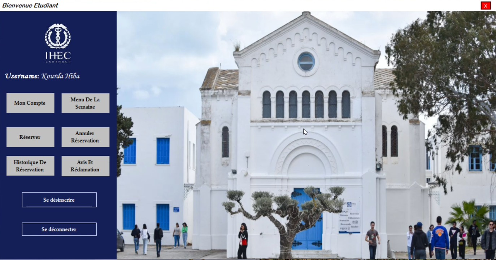

---

### 📝 Créer un Compte — Inscription avec informations personnelles et filière
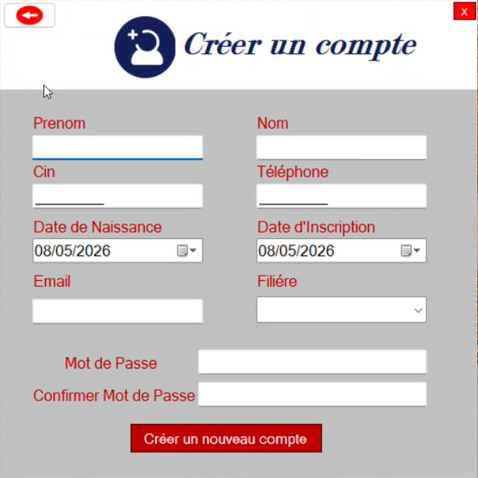

---

### 🔐 Se Connecter — Authentification par CIN et mot de passe
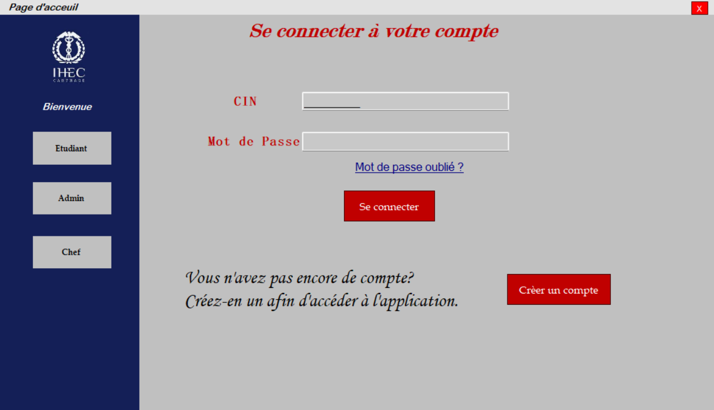

---

### 📧 Confirmation d'Identité — Vérification par code envoyé par mail
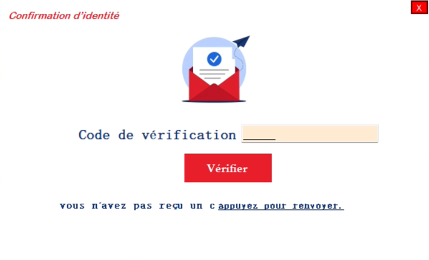

---

### 👤 Mon Compte — Consultation et modification du profil étudiant
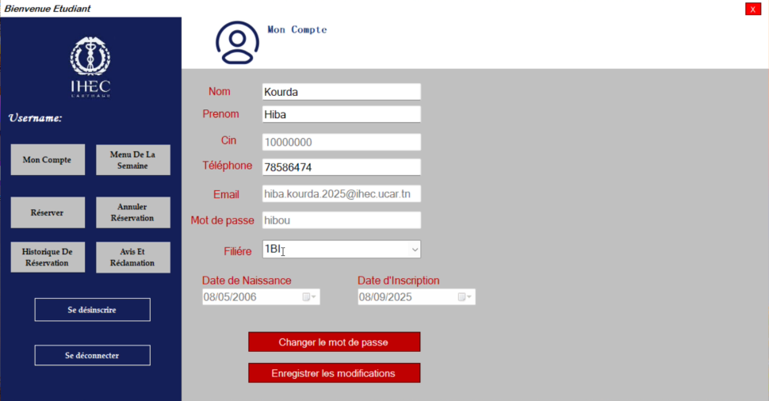

---

### 🍽️ Menu de la Semaine — Consultation des menus journaliers (Menu 1 & Menu 2)
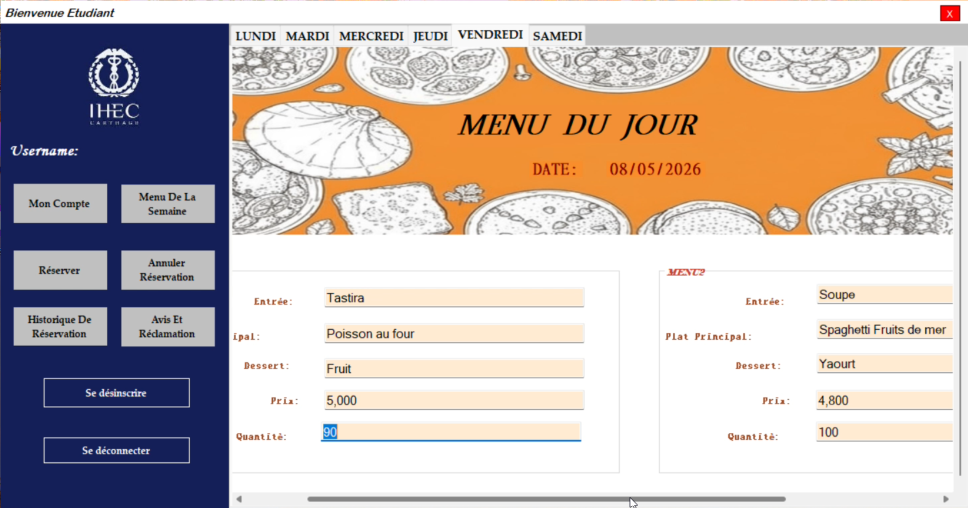

---

### 📅 Réserver un Repas — Sélection de la date et du menu souhaité
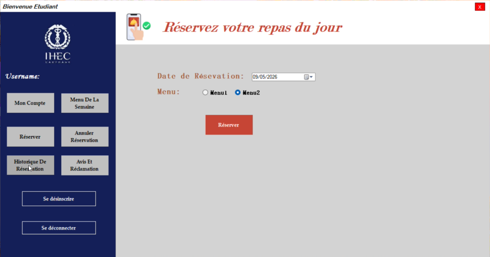

---

### 🕓 Historique des Réservations — Suivi des réservations passées et en cours
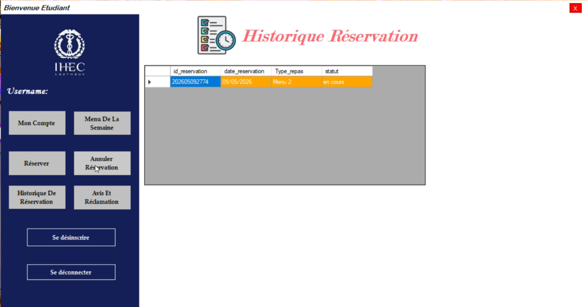

---

### ❌ Annuler une Réservation — Annulation via le code de réservation
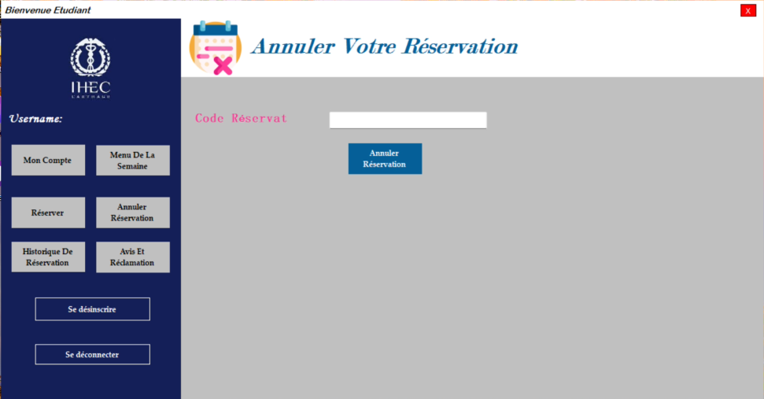

---

### ⭐ Avis & Réclamations — Évaluation du repas par critères et commentaire libre
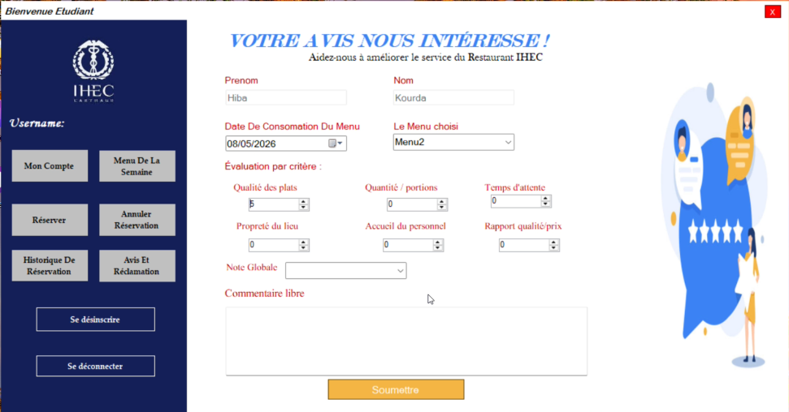

---

## 🛠️ Espace Administrateur

### 👤 Mon Compte Admin — Gestion du profil et des informations de l'administrateur
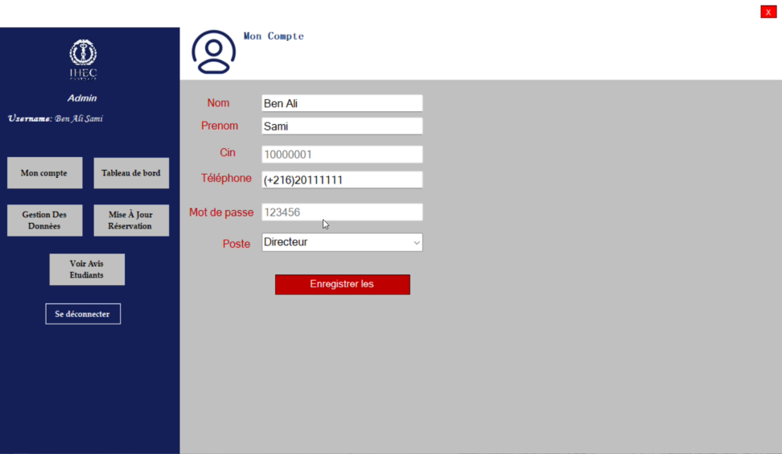

---

### 📊 Tableau de Bord — KPIs, consommation des menus et répartition par filière
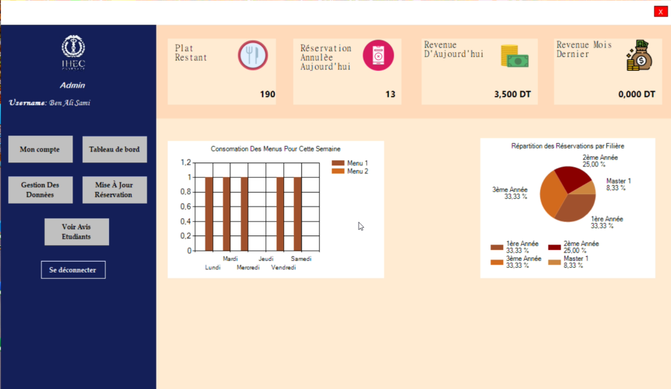

---

### 🔄 Mise à Jour Réservation — Modification du statut d'une réservation par code
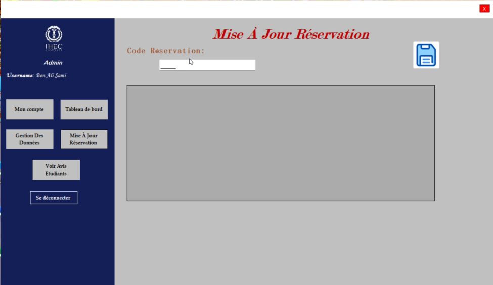

---

### 🗂️ Gestion des Données — Liste des employés et étudiants avec filtres de recherche
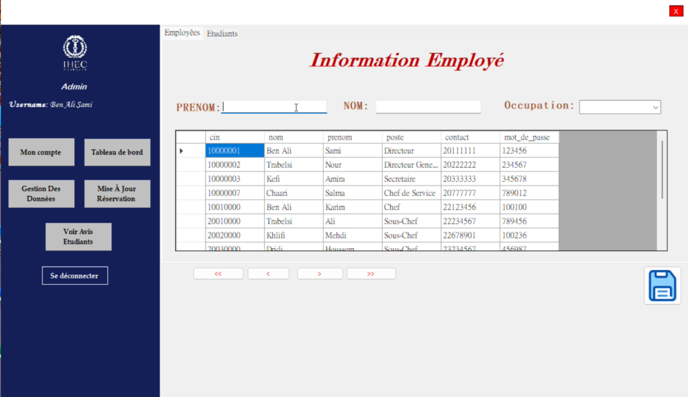

---

### 💬 Voir les Avis Étudiants — Analyse des évaluations et moyennes par critère
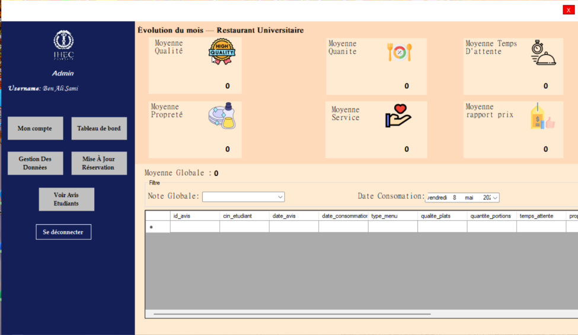

---

## 👨‍🍳 Espace Chef

### 👤 Mon Compte Chef — Consultation et modification du profil du chef
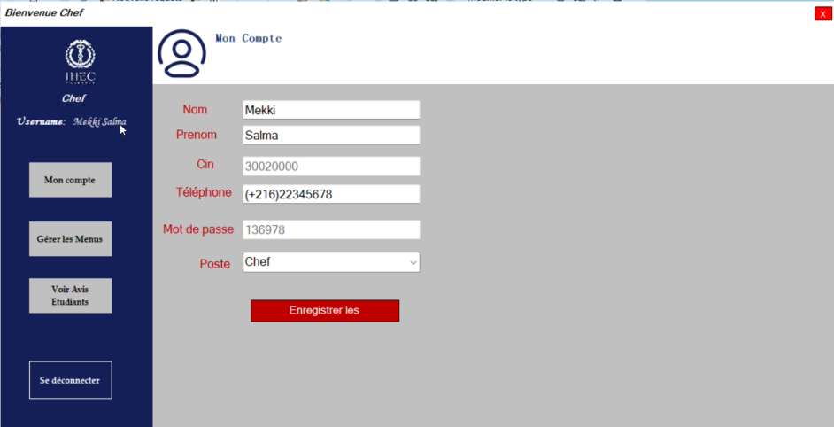

---

### 📋 Gérer les Menus — Saisie des plats, prix et quantités pour chaque jour de la semaine
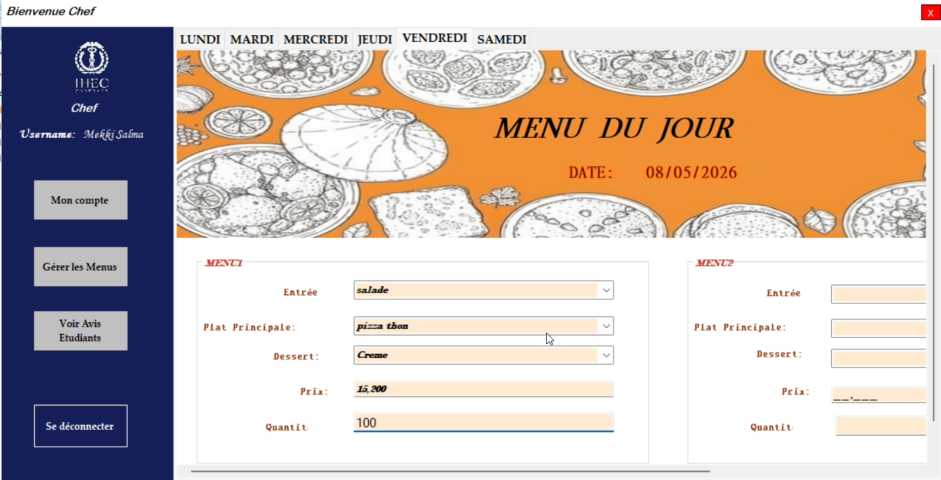

---
# 📄 Rapport du Projet

Le rapport PDF complet du projet est disponible ici :

🔗 [Accéder au rapport complet](https://drive.google.com/file/d/1W3D3_EDWIOi_YUVaigDhexJAkqa8b-CF/view?usp=sharing)

---

# 👩‍💻 Réalisé Par

**Hiba Kourda**  
Étudiante à l’IHEC Carthage  
Année universitaire : **2025 – 2026**
